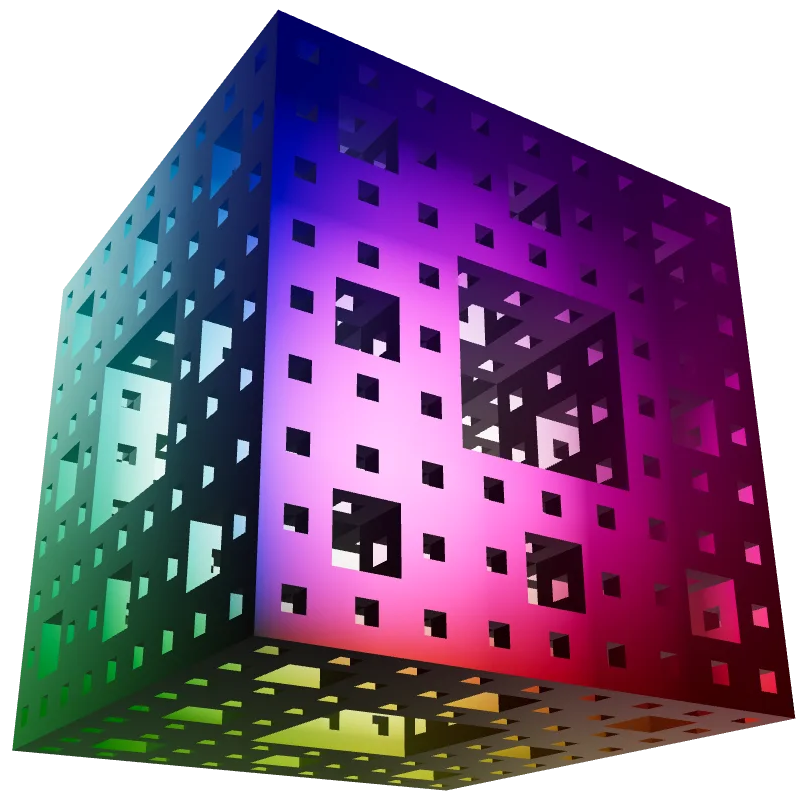

# OManifold

OManifold provides bindings to the [Manifold](https://github.com/elalish/manifold)
solid modelling (C++) library, with integrations into the
[OCADml](https://github.com/OCADml/OCADml) ecosystem. Via Manifold, this library
provides a means to verify, smooth, and perform boolean operations (with guaranteed manifold output) upon meshes generated in OCADml.



## Notable differences from Manifold

- Angles are represented in radians (OCADml convention)
- OCaml runtime lock means that level set mesh generation from signed distance
  functions cannot take advantage of parallelism (sequential execution still provided)

## Usage

``` ocaml
open OCADml
open OManifold

let () =
  let s = Manifold.sphere 20.
  and cyl = Manifold.cylinder ~center:true ~height:40. 10. in
  Export.manifold "example.glb" (Manifold.sub s cyl)
```

## External Dependencies

- [libassimp](https://github.com/assimp/assimp), used for export of meshes from
  the `Manifold.t` and [`MMesh.t`] types
- [OpenMP](https://www.openmp.org/) linkage is `ON` for the Manifold build
- The vendored Manifold library is linked with
 [cuda](https://developer.nvidia.com/cuda-toolkit) if the library is found on
 the system, otherwise it is built without

## Documentation

Documentation for OManifold is available
[online](https://ocadml.github.io/OManifold/OManifold/index.html), covering the
[API](https://ocadml.github.io/OManifold/OManifold/index.html#api). Referring
to the [manual](https://ocadml.github.io/OCADml/OCADml/index.html) for
[OCADml](https://github.com/OCADml/OCADml) is also likely to be helpful.
Finally, as many of the usage examples found in the [OSCADml
documentation](https://OCADml.github.io/OSCADml/OSCADml/index.html#examples) are
largely OCADml centric, they can serve as a reference until similar efforts are
made in this repository.

## Building

Manifold is vendored as a git submodule, so make sure to add
`--recurse-submodules` when cloning, or run `git submodule update --init
--recursive` to update the submodule if already cloned.

```
git clone --recurse-submodules https://github.com/geoffder/OManifold
cd OManifold
dune build
```

Manifold is built with `MANIFOLD_PAR=ON` by default (as recommended), so long as
the parallel execution library TBB is found by `pkg-config`. If you would like
to build without it set `OMANIFOLD_PAR=OFF` in your environment.
